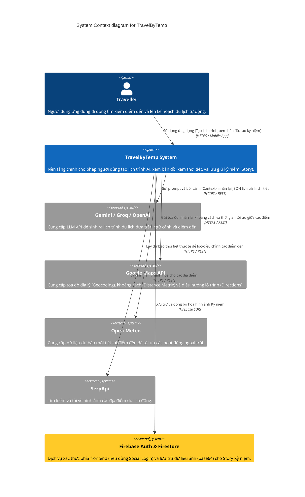

# Context Diagram (C4 Model - Level 1)

Sơ đồ ngữ cảnh (Context Diagram) mô tả các tương tác cấp cao nhất giữa Hệ thống TravelByTemp, Người dùng (Traveller), và các hệ thống/Dịch vụ bên ngoài.

### Chú thích:
- **TravelByTemp System**: Hệ thống trung tâm (Bao gồm Flutter App và .NET 8 Backend + PostgreSQL).
- **External Systems** (Màu xám/vàng): Các hệ thống của bên thứ 3 (Google Maps, Open-Meteo, LLMs API, Firebase) tích hợp vào hệ thống qua REST/SDK.
- **Luồng dữ liệu**: Người dùng thao tác trên Mobile App, Mobile App gọi đến Backend (hoặc Firebase trực tiếp để tải ảnh), Backend điều phối tới các External Services để trả về kết quả cuối cùng.
