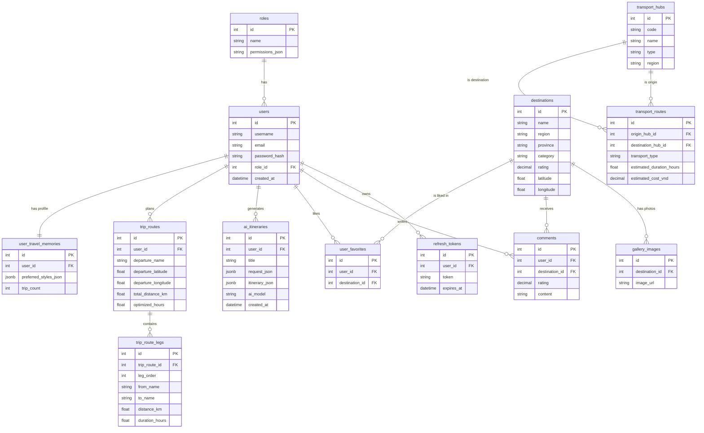

# Entity-Relationship Diagram (ERD)

Dưới đây là sơ đồ thực thể liên kết (ERD) cốt lõi của hệ thống **TravelByTemp** dựa trên cấu trúc Database (PostgreSQL qua Entity Framework Core). Sơ đồ tập trung vào các domain chính: **Authentication/User**, **Destinations**, **AI Itineraries & Routes**, và **Transport**.

### Chú thích các khối chính:
1. **User & Auth**: Bảng `users`, `roles`, và `refresh_tokens` dùng để xác thực và phân quyền.
2. **Core Content**: Bảng `destinations`, `gallery_images`, `comments`, `user_favorites` lưu trữ danh mục điểm đến và tương tác cộng đồng.
3. **AI Planning**: `ai_itineraries`, `trip_routes`, `trip_route_legs` lưu trữ các lịch trình sinh ra bằng AI, bao gồm các chặng di chuyển (legs) được tối ưu bằng Google Maps.
4. **Transport**: Bảng `transport_hubs` (sân bay, bến xe) và `transport_routes` hỗ trợ tính toán lộ trình di chuyển liên tỉnh/vùng.

*(Lưu ý: Storage của Firestore chứa các hình ảnh Story sẽ liên kết logic qua `uid` của user, không thể hiện trực tiếp trong CSDL SQL này).*
