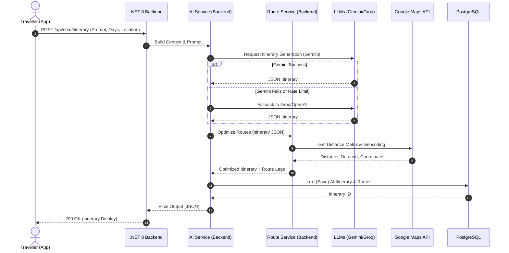
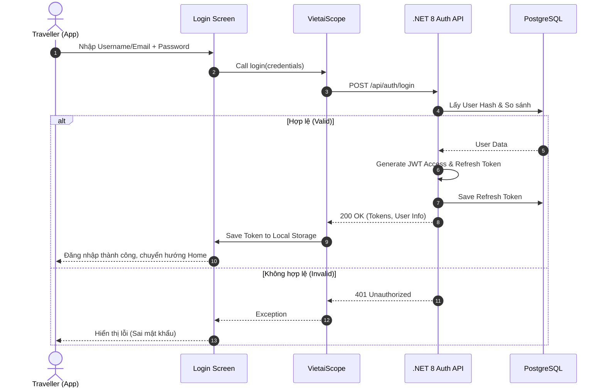
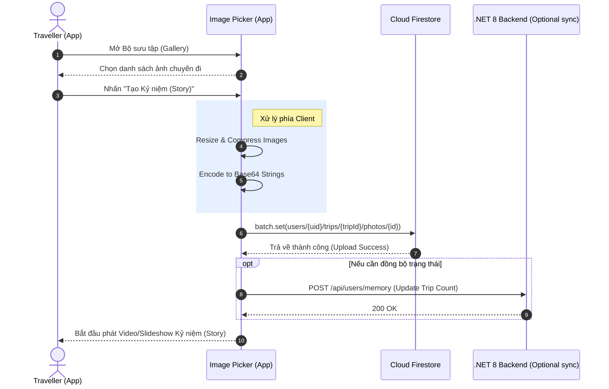

# Biểu đồ Tuần tự (Sequence Diagrams)

Tài liệu này bao gồm các biểu đồ tuần tự (Sequence Diagram) minh họa luồng xử lý của 3 nghiệp vụ quan trọng nhất trong hệ thống **TravelByTemp**.

---

## 1. Luồng Lập Kế hoạch Bằng AI (AI Planning Flow)
Mô tả quá trình người dùng yêu cầu tạo lịch trình, Backend xử lý fallback qua nhiều LLM và tối ưu lộ trình bằng Google Maps.

---

## 2. Luồng Xác Thực (Login & Auth Flow)
Mô tả quá trình người dùng đăng nhập bằng hệ thống nội bộ để nhận JWT Token.

---

## 3. Luồng Tải lên Kỷ niệm / Story (Story Upload Flow)
Mô tả cách thức ứng dụng nén ảnh thành Base64 và lưu trực tiếp lên Firebase Firestore để tối ưu backend chính.

